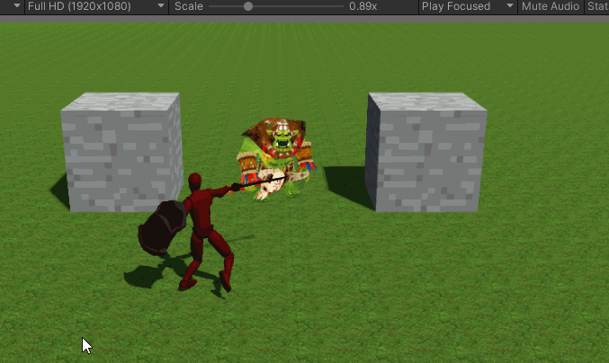

Sample Code For my Unity Design Patterns Class
====

A demo scene with a player character that can attack enemies and explodable obstacles.

Things shown:

* Inversion Of Control: check out `TriggerEventStateMachineBehaviour`
* Asyncronous Programming: check out `PlayerController` and `IAttackTarget.OnAttackHit`
* Editor Scripting: check out `UnityObjectDropdownPropertyDrawer` and `TableEditorWindow`